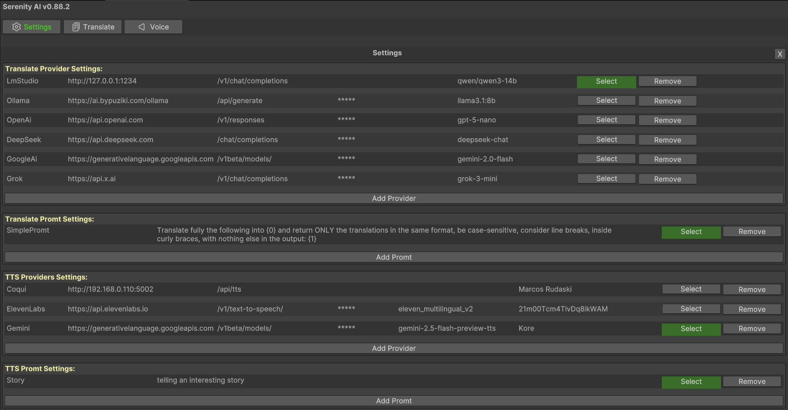
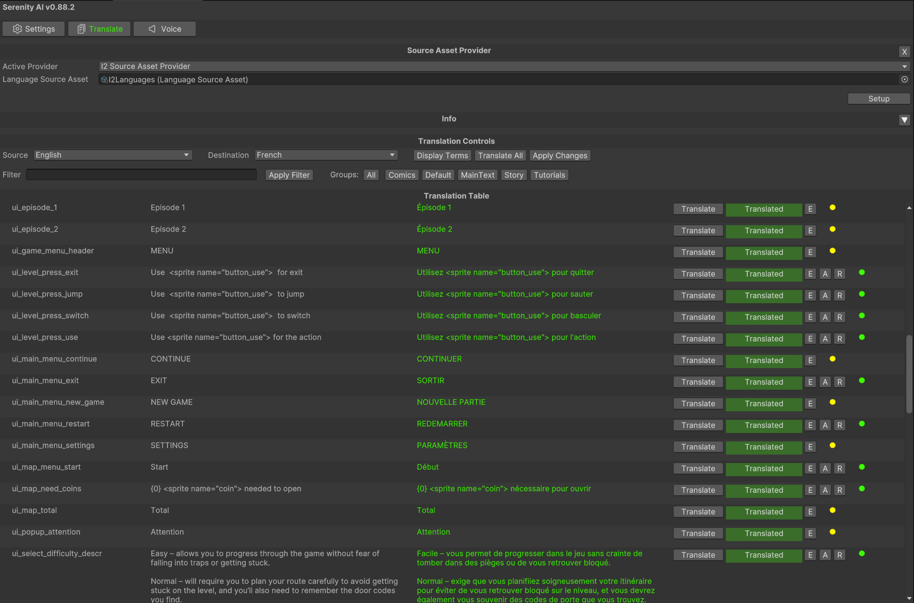
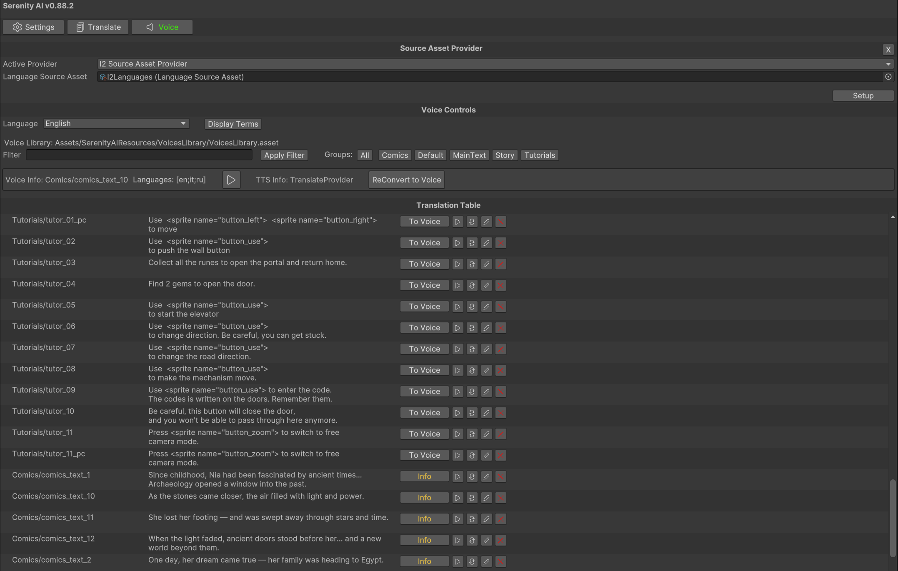

# Serenity AI Translator

Serenity AI Translator is a Unity Editor tool for translating localization text with AI providers and generating voice clips with TTS providers.

It is designed for projects that already use a localization system and want a faster workflow for:

- translating terms into multiple languages;
- reviewing and applying translated text;
- generating voice clips from localization text;
- keeping AI provider settings inside the Unity Editor.

## Installation

Install the package from Unity Package Manager:

1. Open `Window > Package Manager`.
2. Click `+`.
3. Select `Add package from git URL...`.
4. Paste:

```text
https://github.com/denkacn/SerenityAITranslator.git
```

Unity will install the package and its required dependency:

- `com.unity.nuget.newtonsoft-json`

## Open The Tool

After installation, open:

```text
Tools > Serenity AI Translator
```

The window has three main tabs:

- `Settings` - configure AI providers and prompts.
- `Translate` - load localization terms and translate text.
- `Voice` - generate and manage voice clips.



## Choose A Localization Source

The main package does not force one localization system. Install the source provider extension that matches your project.

Included extensions:

- `I2SourceAssetProviderExtension.unitypackage` for I2 Localization.
- `UnityLocalizationSourceAssetProviderExtension.unitypackage` for Unity Localization.

To use one:

1. Find the extension package in the installed package folder.
2. Import the `.unitypackage` into your project.
3. Create the provider asset from Unity's `Create` menu:
   - `SerenityAI > Providers > I2SourceAssetProvider`
   - or `SerenityAI > Providers > UnityLocalizationSourceAssetProvider`
4. Assign your localization asset/table settings on that provider asset.
5. Open Serenity AI Translator and select the provider in the `Source Asset Provider` section.
6. Click `Setup`.

If no source provider appears, click `Reload` in the `Source Asset Provider` header after creating the provider asset.

## Configure Translation

Open the `Settings` tab and add a translate provider.

Supported text providers:

- LM Studio
- Ollama
- OpenAI
- DeepSeek
- Google AI
- Grok
- Google Translate

For most providers you need:

- provider type;
- host and endpoint;
- API token or token file;
- model name.

After saving a provider, click `Select` next to it. The selected provider button changes to `Selected`.

## Configure Prompts

In the `Settings` tab, add or select prompts for translation and TTS.

Translation prompts can use placeholders expected by the package, such as target language and source language. The default prompt is created automatically when needed, so you can start without editing prompts.

## Translate Text



1. Open the `Translate` tab.
2. Select your source asset provider.
3. Choose source and destination languages.
4. Load terms from the selected localization source.
5. Use one of the translation actions:
   - translate one row;
   - translate selected rows;
   - translate all rows;
   - translate one row to all languages.
6. Review generated translations.
7. Apply changes back to the localization source.

The table lets you switch between original and translated text, edit generated text, and apply or revert changes.

## Configure Text To Speech

Open the `Settings` tab and add a TTS provider.

Supported TTS providers:

- Coqui
- ElevenLabs
- Gemini
- Resemble

For most providers you need:

- provider type;
- host and endpoint;
- API token or token file;
- model name;
- voice name.

After saving a provider, click `Select` next to it.

## Generate Voice Clips



1. Open the `Voice` tab.
2. Select the same source asset provider used for translation.
3. Select a TTS provider in `Settings`.
4. Choose the terms you want to generate.
5. Generate voice clips.
6. Use `Info`, `Play`, `Text to Speech`, `Edit`, and `Delete` controls to manage generated clips.

Generated voice library data is stored in your Unity project outside the package.

## API Tokens

Provider settings can contain API tokens.

Recommended options:

- use token files instead of pasting tokens directly;
- keep local settings out of source control;
- do not commit generated project data that contains secrets.

## Project Data

Serenity AI Translator creates project-specific data in your Unity project, outside the installed package.

This includes:

- provider settings;
- prompt settings;
- session state;
- generated voice library data.

These files belong to your project and can be handled according to your team's source-control policy.

## Notes

- The package is Editor-only.
- Source provider extensions are optional, but at least one is required to load localization terms.
- If Unity keeps an older package version after updating from git, remove the old package cache or force Package Manager to update the git revision.
